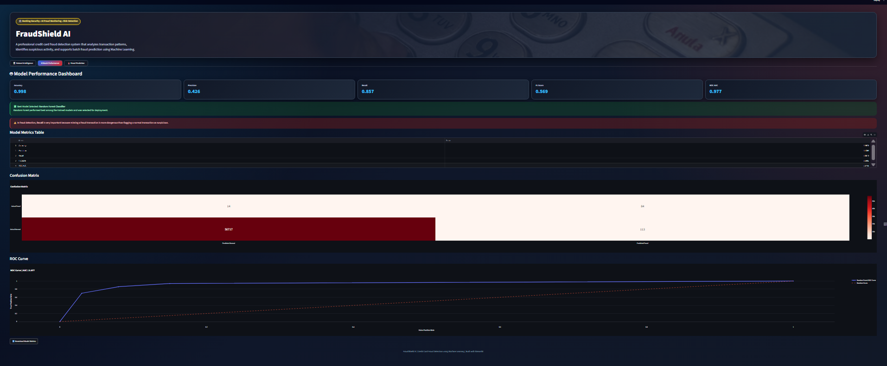

# 💳 FraudShield AI - Credit Card Fraud Detection System

FraudShield AI is a machine learning based credit card fraud detection dashboard built using Python, Random Forest, SMOTE, and Streamlit.

## 📌 Project Overview

This project detects fraudulent credit card transactions using machine learning. The dataset is highly imbalanced, so SMOTE was used to balance the training data. Random Forest was selected as the best performing model.

## 🚀 Features

- Dataset dashboard
- Fraud percentage analysis
- Normal vs fraud transaction visualization
- Transaction amount distribution
- Model performance dashboard
- Confusion matrix
- ROC-AUC section
- CSV upload for batch fraud prediction
- Download prediction results

## 🛠️ Technologies Used

- Python
- Pandas
- NumPy
- Scikit-learn
- Imbalanced-learn
- Random Forest Classifier
- Streamlit
- Plotly

## 📊 Model Performance

| Metric | Score |
|---|---|
| Accuracy | 0.9977 |
| Precision | 0.4263 |
| Recall | 0.8571 |
| F1 Score | 0.5694 |
| ROC AUC | 0.9768 |

## 📸 Screenshots

### Dataset Dashboard


### Model Performance


### Prediction Result


## 📂 Project Structure

```text
Credit_Card_Fraud_Detection/
│
├── data/
│   └── creditcard.csv
├── notebook/
│   └── fraud_detection.ipynb
├── demo_csv_files/
├── screenshots/
├── app.py
├── model.pkl
├── scaler.pkl
├── columns.json
├── requirements.txt
└── README.md